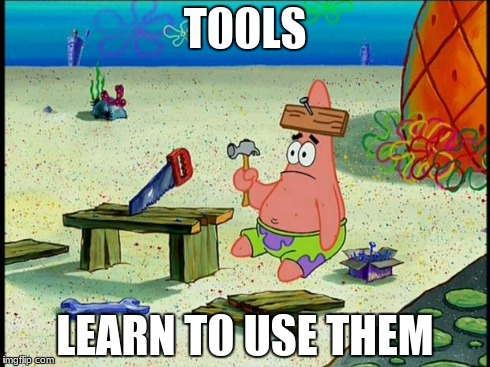

This week, I had the opportunity to work in a small personal project: a simple, static website for a family member (someone said portfolio?). I've done some sites like this in the past, but I wanted to apply some of my recently acquired WebDev-fu, and this proved to be quite harder than it seemed.

##Bringing a Gun to a Knife Fight

My natural reaction was trying to use the **stack** I'm learning, which is **MEAN** (minus the A), but since it's was a static site, MongoDB wasn't really a useful tool on this scenario, and my *client* already has a hosting account, so no E and N either. What does that leave? Focusing on the frontend as much as possible. and since it's only a *relatively* small business website, no MEAN for me this time.

##Framweworks and Going Minimal



**I'm going to use a framework!** *said to myself*, but after reviewing the major players (React, Angular, Backbone), I came to the conclusion that such frameworks were overkill for what I needed. In fact, the project only required something to handle client-side routing (maybe) and some dynamic elements, so I started looking at more minimal frameworks.

The ones that were in my bookmarks included [Mithril](http://lhorie.github.io/mithril/), [Riot](https://muut.com/riotjs/) and [Cycle](https://github.com/staltz/cycle) (because Rx), but then again, after tinkering half-evening with all of them, I learned something: **minimal is not the same as simple**. All of them boast a minimalistic approach to MV-C/I/VM/whatever, but also, all of them had to make serious [trade-offs](https://medium.com/i-m-h-o/oversimplifying-things-is-not-an-advantage-89c560fb21c3) in order to stay on the micro/minimal league. I liked them all, but none of them fit the simplicity I needed for this kind of website.

##Simple but Powerful Workflow

Following my brief experience with frameworks, I decided that a framework wasn't really needed, but instead a good ***workflow environment*** to make simple, static sites in a fast, consistent way, using modern tools. So I started **making one**. As an initial point, I added **Gulp** and **Browserify**, also **Sass** for CSS and **Jade** for templates. Git was the obvious choice for version control.

I also wanted a good starting point in terms of page structure, like HTML5 Boilerplate/Initializr, and some style consistency among browsers, so I added [Normalize.css](http://necolas.github.io/normalize.css/), [html5shiv](https://github.com/aFarkas/html5shiv) and [HTML5 doctor reset stylesheet](http://html5doctor.com/html-5-reset-stylesheet/) (just in case a complex custom design was needed).

Regarding CSS frameworks, I'm getting used to **Bourbon/Neat** as it's less cluttered than Bootstrap, so I also included them, with the great benefit that the resulting CSS files only include the used CSS mix-ins, resulting in less space being wasted. If you go for Bootstrap, don't forget to **uncss** when you build.

##Integrating the Tools

When you start adding features and complexity to a project, it's hard to put everything together. Luckily, with the help of Git, npm, Gulp and Browserify, it's much easier than it seems. Best of all, I found an excellent starting point for what I wanted to do. [Gulp Starter](https://github.com/greypants/gulp-starter) had many of the tools I wanted, but also many extras added as default, and some other things that were missing.

I went on and started modifying the project. Added something here and there, removed, changed, edited and tweaked, and, about an hour later, a working version of the **project starter** was already working. I think it's a very good starting point for any kind of frontend projects since it's very easy to modify and customize for specific needs. Gulp tasks are modularized (from Gulp-starter) so you can add and remove tasks without much effort. The same applies to libraries, adding new ones is as easy as installing them via npm. You can see the project on the link below:

Get (fork) [Static-Starter](https://github.com/crisberrios/static-starter) at GitHub.

Another added benefit of running a static project *generator* like this, is that you don't even need a paid hosting for development (and even some production) purposes. You can run your sites directly from [RawGit](http://rawgit.com/) and even serve all the snapshots/versions simultaneously.

##Final thoughts

There's still a lot to do with my little project, like including some default tests and better support for adding data to Jade templates, but overall it let me do a very smooth and steady progress with the static site I was going to do, and will also serve me as a base for many future projects. When developing, there's nothing better than just opening the console, writing **gulp** and let the [BrowserSync](http://www.browsersync.io/) fun begin!

I hope you liked the idea and find the project useful, even if only as a little reference for making your own starter, and if you think there's a way to improve it, please contribute or let me know.

Let's code!

