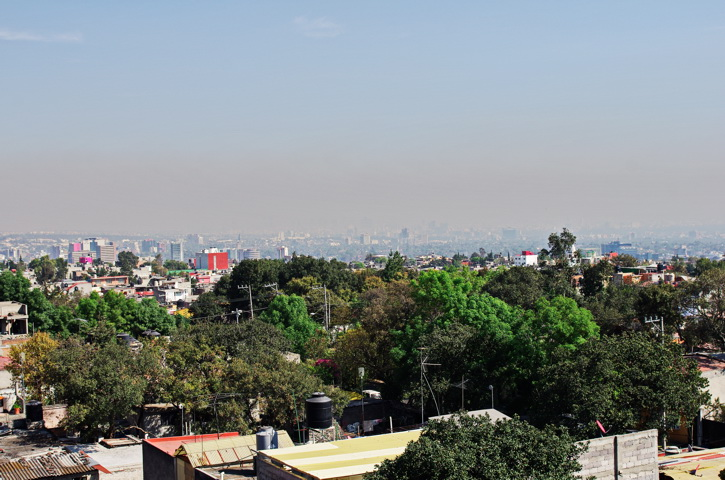

So here I am. Living in the outskirts of Mexico City while learning how to _properly_ code and become a full stack web developer with the help of [Free Code Camp](https://www.freecodecamp.org) online bootcamp.

What was I doing before this? Well, this isn't my first coding experience, nor my first web-dev experience. I *used to be* (since I'm switching careers) an electronics engineer, and I've done some nice and interesting projects, mostly related with **M2M** and **Fleet Management** services, coding firmware for embedded devices and making scripts for data terminals.

Also, I've participated in the design and implementation of a variety of Wordpress sites/blogs, static HTML sites and worked as SEO/SEM manager for small businesses as my hobby side job.

But I never took the time to properly learn JavaScript, CSS, and HTML (HTML5 was a new thing for me). Mostly hacking some scripts here and there, copy-pasting some PHP to make a plug-in work and inline-css-ing to fix some details.

#What changed?#

Well, ever since I met my wife, we have been spending our savings not in a mortgage, or even a car. We have been **travelling** (not as much as you think, but one of our dreams was visiting Japan), and somewhere along the road we decided we should get out of our country and be on the move, in search of new adventures and a better quality of life.

First step: finding a stable job in another country. Since my wife's work is in the academic field, that meant her getting a PhD first or me finding a job in another country. And that leads us to...

Second step: her being accepted in a doctorate program here in Mexico (top choice in her field). As for me? Look at the next picture:

See the pale shapes behind that big cloud of smog? Well, that's where downtown is, **about 2 hours from here**. Add **another hour** to the industrial sector of the city, where most of the jobs that I qualify for are located. A big change from the 10 minute walk to my old job back in Chile.

So what to do? My field of work isn't particularly remote-able, and I'm not fond of the idea of travelling 6 hours every day, so I decided I should learn software development and work from anywhere in the world.

Then what? Well... Alternatives seemed to be JavaScript, Python or Ruby. But JS was frontend-only... no... wait! A friend of mine mentioned Node.JS before we left our country.
And JS is quite similar to C and C#, which I've dealt with before, so it seemed to be the perfect choice!

So, after some research, I started with "Learn JavaScript properly", then jumped to "[Mejorando.la](http://mejorando.la)", a site in spanish site with paid courses, and after a 3 month break for a somewhat failed Internet Marketing project, I came back to learning JS, and that's where I found *FCC*.

And what's next? Well, I've recently finished the challenges and I've started my first project for a nonprofit organization called [Kopernik](http://kopernik.info/). It's very nice to be able to help people with this kind of work and I really hope I can do many projects, even after I finish the **900 hours** of nonprofit work.

Also, I wish I can keep helping other people in the FCC community as many don't have a coding background but are very motivated in learning how to code, and there is proof that even beginners can get quickly up to speed with coding, and hopefully improve their lives with the skills acquired.
